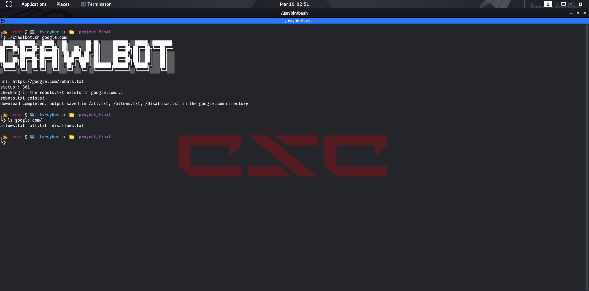

## About CrawlBot
CrawlBot is a simple shell script which can be used to crawl the 'robots.txt' of a given domain. If the process is successful, the result will be listed into 3 different text files `(allows.txt, disallows.txt, all.txt)` in the created domain directory. 

## Screenshots

 
 
 

 

## Installation
 
```console
user@example:~git clone
user@example:~cd crawlbot
user@example:~chmod +x *
user@example:~./crawlbot.sh domain_name
```


## Usage
```
example:~./crawlbot.sh domain_name
user@example:~./crawlbot.sh google.com
```

## Credits
* [Adhithyan]( https://github.com/adhithyanmv )
* [Nithin M]( https://github.com/nithin62 )
* [Angel Mariya]( https://github.com/mariyaangel )
* [Ranjith]( https://github.com/hackerPPi )
* [Ryan Roy Joseph]( https://github.com/RyanRoy626 )
* [Mithin Kuttan]( https://github.com/mithinkuttan )
* [Athul George]( https://github.com/atulgorgkgdy)
* [Shyam S]( https://github.com/shyams47 )  
* [Muhammed Shareef M T]( https://github.com/shareefshaz )
* [Adharsh K K]( https://github.com/adarshkk99 )
* [Sivaprasad S]( https://github.com/sivaprasad789/sivaprasad789.git )
* [Meenu Cleetus]( https://github.com/meenucletus)
* [Vinita Umesh]( https://github.com/Zenith-Paradox ) 

 
## Special thanks to:
 * [Nicy Jose](https://github.com/NicyJoseAJ)
 * [Sarath G](https://github.com/secretguard)
 
## Version
**Current version is 1.0**
 
